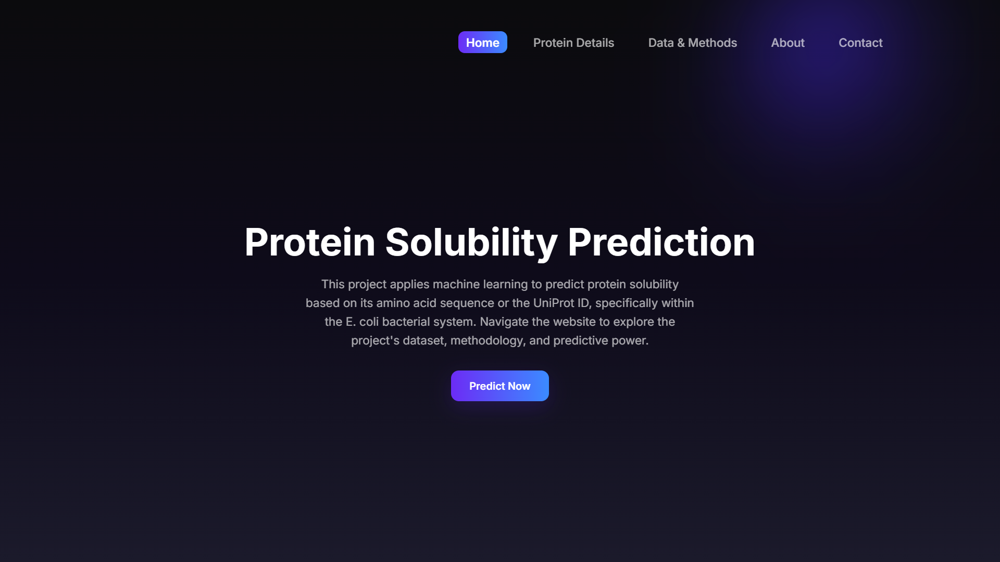
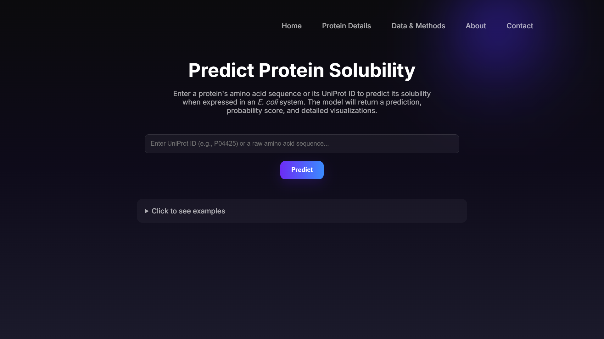
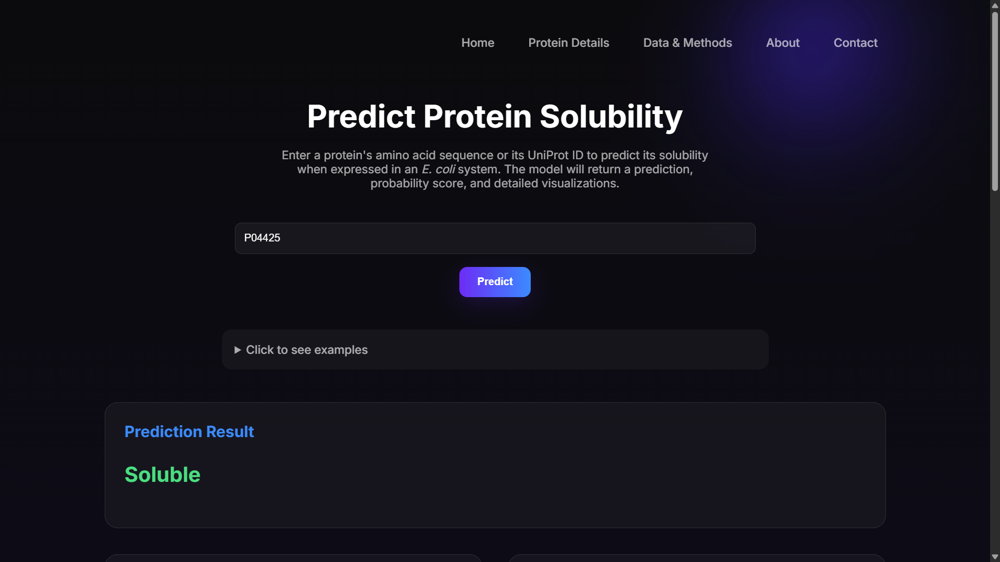
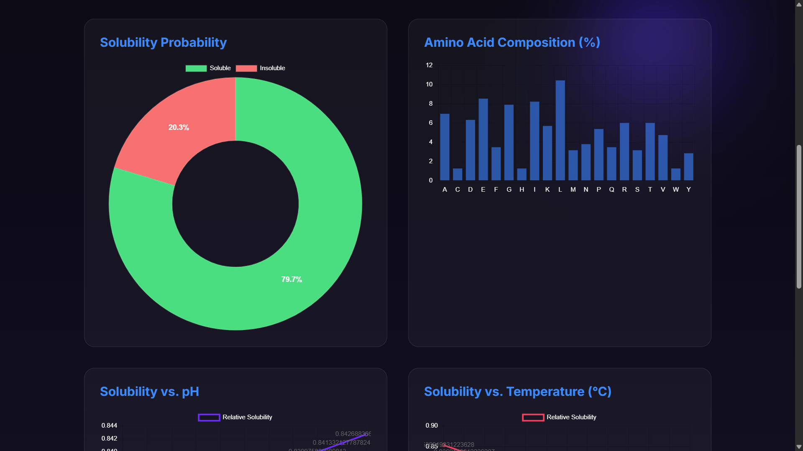
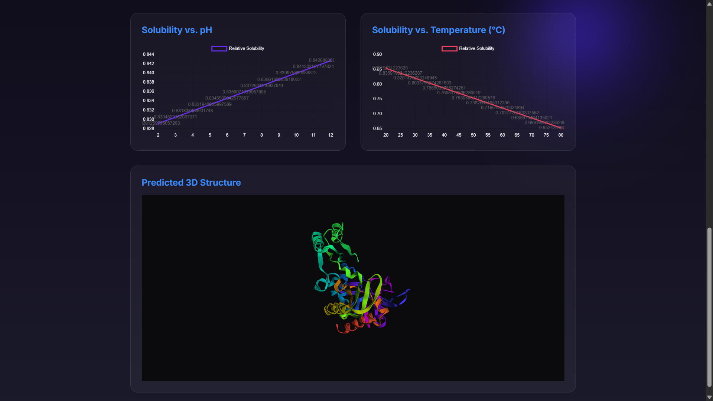

# Protein Solubility and Structure

## Description

This project predicts **protein solubility in an *E. coli* environment** using a machine learning model trained on amino acid composition features.
In addition, it provides **interactive 3D protein structure visualization** by retrieving structures from established protein structure databases.

## Live Demo

**Link:** [https://adityakumar008.github.io/protein-solubility-and-structure/](https://adityakumar008.github.io/protein-solubility-and-structure/)

## Features

* Protein solubility prediction (*E. coli* expression context)
* Supports **UniProt ID** or **amino acid sequence** as input
* Uses a **Random Forest model trained within this project and saved for reuse**, avoiding retraining on every run
* Automatic **3D protein structure fetching and visualization**
* Interactive web-based interface for analysis

## Screenshots

### Home Page

### Prediction Interface

### Prediction Results

### Analysis & Visualizations

### 3D Protein Structure Visualization

## Why Protein Solubility Matters

Protein solubility is a critical factor in **recombinant protein expression**, especially in *E. coli*.
Low solubility often leads to:

* Protein aggregation
* Inclusion body formation
* Reduced yield and functionality

Predicting solubility in advance helps in **protein design, expression optimization, and experimental cost reduction**.

## 3D Structure Source

The 3D protein structures are **not predicted from scratch** in this project.
Instead, they are **retrieved from trusted biological databases**:

* **RCSB PDB** (primary source, if an experimentally determined structure exists)
* **AlphaFold Protein Structure Database** (used as a fallback when PDB data is unavailable)

Structure retrieval is performed dynamically using the **UniProt ID** and visualized using `py3Dmol`.

## Tech Stack

* Python
* Flask
* Machine Learning (Random Forest, scikit-learn)
* Pandas, NumPy
* HTML, CSS, JavaScript
* py3Dmol (3D visualization)

## How to Run

> ⚠️ Note: The backend code, datasets, and trained model files (`app.py`, `Final_Code.py`, `*.csv`, `*.joblib`) are **not pushed to GitHub** and must be run locally or deployed on a server.

1. Set up the backend environment with required dependencies
2. Run the Flask server (`app.py`) to activate the model and API
3. Open the frontend in a web browser
4. Enter a **UniProt ID** or **amino acid sequence** to predict solubility and view structure

## Project Structure

* `app.py` – Flask backend server
* `Final_Code.py` – Complete ML pipeline and analysis logic
* `*.csv` – Training and mapping datasets
* `*.joblib` – Pre-trained Random Forest model
* `*.html` – Frontend interface

## Author

**Aditya Kumar**  
LinkedIn: [https://www.linkedin.com/in/aditya-kumar-b7920b328](https://www.linkedin.com/in/aditya-kumar-b7920b328)  
GitHub: [https://github.com/AdityaKumar008](https://github.com/AdityaKumar008)